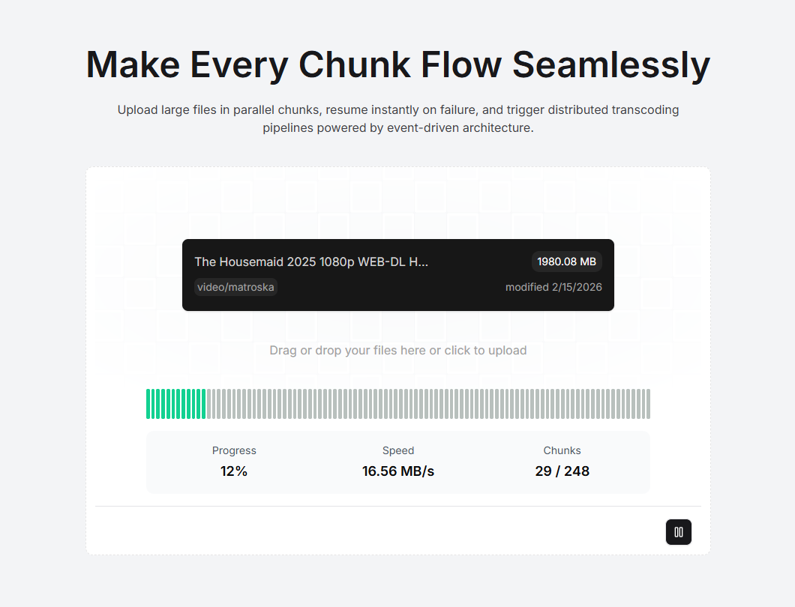

# 🚀 Chunked S3 Uploader

A high-performance, resumable file upload system built using Node.js and AWS S3 Multipart Upload.

This project enables large file uploads to Amazon S3 using chunked multipart uploads with retry support, progress tracking, and failure recovery.

---

## 📌 Features

- Multipart upload to Amazon S3
- Chunked file uploads (configurable chunk size)
- Parallel uploads with configurable concurrency
- Retry mechanism for failed chunks
- Resume interrupted uploads
- Upload progress tracking
- Abort upload support
- Backend signed URL generation
- Production-ready S3 integration

---

## 🛠 Tech Stack

- Node.js
- Express.js
- @aws-sdk/client-s3
- @aws-sdk/s3-request-presigner
- Next.js (Frontend)
- Amazon S3 Multipart Upload API

---